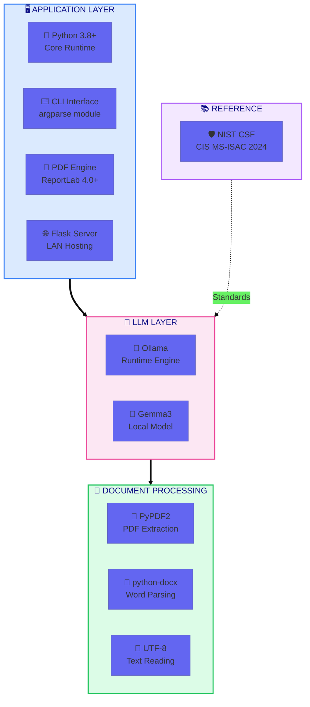
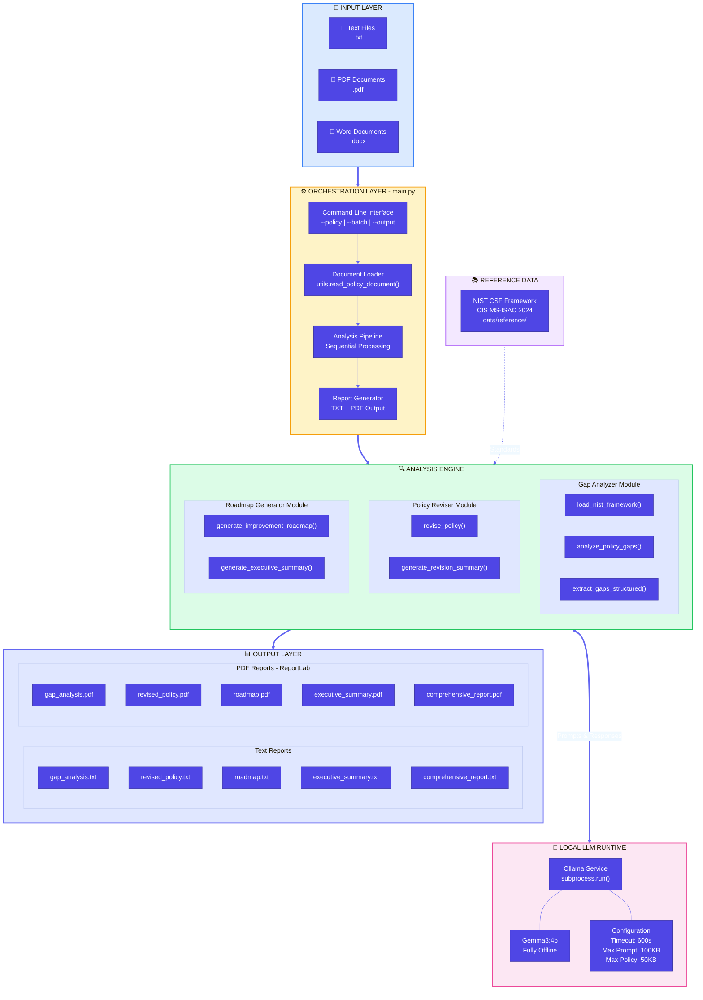
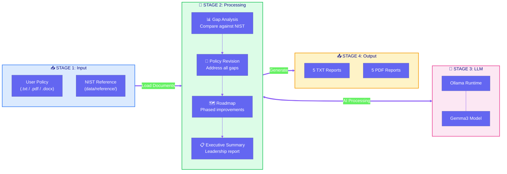
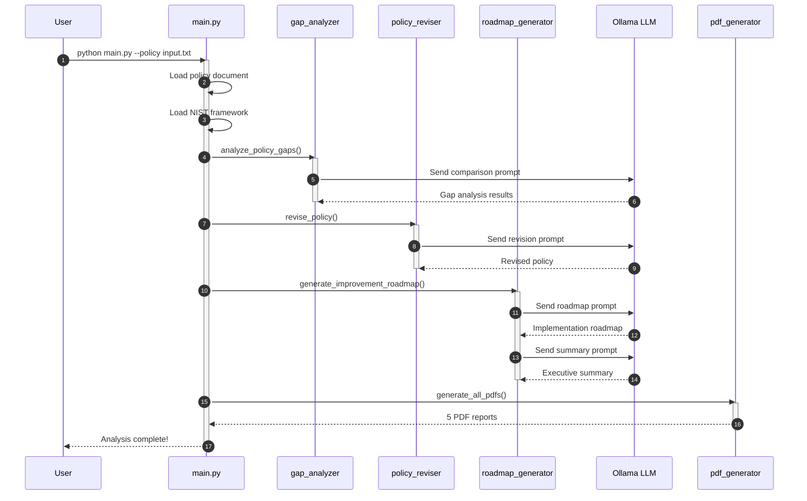
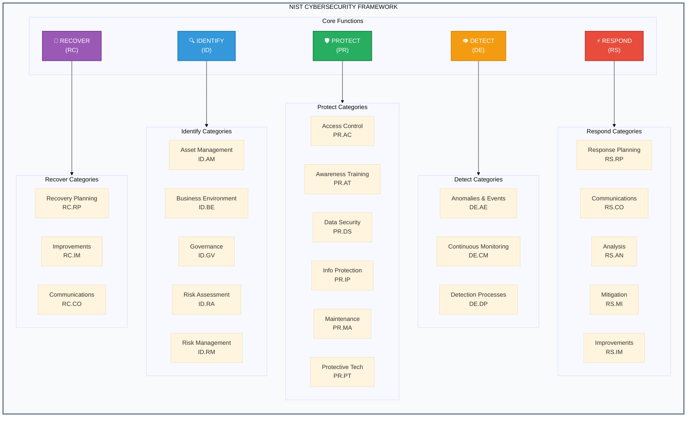
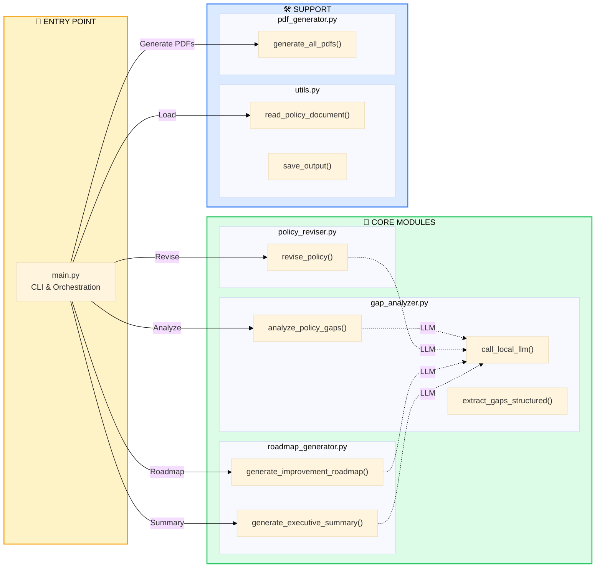
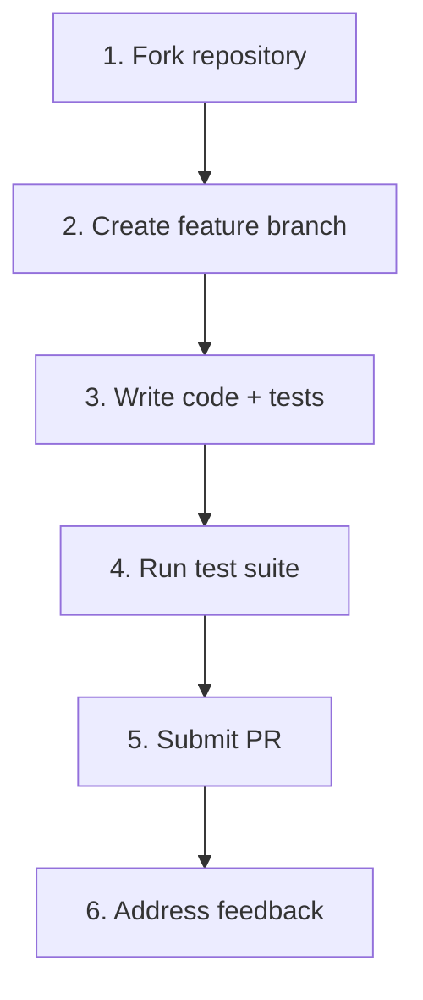

<p align="center">
  
  
  
  
</p>

<h1 align="center">Local LLM Policy Gap Analyzer</h1>
<h3 align="center">Privacy-First Cybersecurity Policy Analysis Against NIST CSF Standards</h3>

<p align="center">
A fully offline, lightweight system for analyzing organizational cybersecurity policies against NIST Cybersecurity Framework standards using a local Large Language Model.
</p>

---

## Introduction

Organizations struggle to maintain cybersecurity policies that align with industry standards. This tool provides **automated gap analysis** by comparing your policies against the **NIST Cybersecurity Framework** using a local LLM (Gemma3 via Ollama). Every operation runs entirely on your machine—**no cloud APIs, no data collection, complete privacy**.

The system identifies policy weaknesses, generates revised policies addressing those gaps, and creates phased implementation roadmaps—all in professional PDF and text formats.

---

## What's New (March 2026)

- **Improved File Organization**: DOCX files now display in left column, PDF files in right column for better visual organization
- **ZIP Download**: All reports can now be downloaded as a single ZIP archive for convenience
- **Hidden Vulnerability Reports**: Vulnerability analysis PDFs are automatically saved to `risk_analysis/` folder (hidden from users)
- **Auto-Directory Creation**: System automatically creates required directories (`data/`, `risk_analysis/`) on first run
- **Persistent Job History**: Analysis history now persists across server restarts via JSON storage (`data/job_history.json`)
- **Smart History Filtering**: History automatically hides jobs whose output files have been deleted
- **Fixed PDF Downloads**: Resolved path handling issues for PDF downloads and inline viewing on Windows
- **Fixed PDF Modal Viewer**: View button now correctly opens PDFs in the inline modal viewer
- **Live Analysis Logs**: Real-time log streaming on the status page so users can watch each pipeline step
- **Global Analysis History**: Dedicated `/history` page to view jobs from all LAN devices in one place
- **JSON Status API**: Added `/api/status/<job_id>` for smooth in-page updates without full-page refresh
- **Input Sanitization**: Removes invisible/zero-width Unicode artifacts from extracted document text
- **Removed Vulnerability DOCX**: Vulnerability analysis no longer generates DOCX files (PDF only, hidden)
- **Enhanced Security**: Comprehensive prompt injection protection with centralized security instructions
- **Contact Information Filtering**: Automatically removes emails, phone numbers, URLs, and social media handles from LLM outputs
- **Centralized Prompt Configuration**: All LLM security rules managed from single `prompt_config.py` file

---

## Table of Contents

| Section                                               | Description                           |
| ----------------------------------------------------- | ------------------------------------- |
| [Features](#features)                                 | Core capabilities                     |
| [What's New](#whats-new-march-2026)                   | Recent updates                        |
| [Tech Stack](#tech-stack--prerequisites)              | Technologies and requirements         |
| [Architecture](#architecture-diagram)                 | Visual system overview                |
| [Project Structure](#project-structure)               | File organization                     |
| [Security Features](#security-features)               | LLM security & threat protection      |
| [Quick Start](#quick-start-user-instructions)         | Get running in 5 minutes              |
| [Developer Guide](#developer-guide)                   | Contributing code                     |
| [Contributor Expectations](#contributor-expectations) | Guidelines for contributors           |
| [Known Issues](#known-issues--limitations)            | Current limitations                   |
| [PDF Enhancement](BEFORE_AFTER_COMPARISON.md)         | Before/After comparison of PDF output |
| [📄 README.pdf](README.pdf)                           | PDF version with rendered diagrams    |

---

## Features

| Feature                    | Description                                                                 |
| -------------------------- | --------------------------------------------------------------------------- |
| **Gap Analysis**           | Identifies policy weaknesses against NIST CSF standards                     |
| **Vulnerability Analysis** | Security vulnerability assessment (saved to hidden `risk_analysis/` folder) |
| **Policy Revision**        | Auto-generates improved policy versions addressing gaps                     |
| **Implementation Roadmap** | Phased improvement plans (0-3, 3-6, 6-12 months)                            |
| **Executive Summary**      | Leadership-ready overview of findings                                       |
| **Multi-Format Input**     | Supports `.txt`, `.pdf`, and `.docx` policies                               |
| **Multi-Format Output**    | Professional DOCX and PDF reports using ReportLab                           |
| **ZIP Archive**            | Download all reports as a single ZIP file                                   |
| **Batch Processing**       | Analyze multiple policies in one run                                        |
| **LAN Web Server**         | Flask-based web UI — any device on the network can upload & analyze         |
| **Rate Limiting**          | Per-IP job limits + serialized LLM queue prevent overload                   |
| **Live Status & Logs**     | AJAX status polling and real-time step logs on the status page              |
| **Global Job History**     | Dedicated `/history` page listing all jobs across LAN clients               |
| **Persistent History**     | Job history survives server restarts and auto-cleans deleted files          |
| **Input Sanitization**     | Removes invisible/zero-width Unicode artifacts from extracted document text |
| **Prompt Injection Defense** | Multi-layer protection against LLM manipulation and jailbreak attempts    |
| **SSRF Protection**        | Blocks cloud metadata, localhost, and internal IP access attempts           |
| **Contact Info Filtering** | Removes emails, phone numbers, URLs, social media handles from outputs      |
| **100% Offline**           | Zero network calls after initial setup                                      |

---

## Tech Stack & Prerequisites

### Technology Stack



### System Requirements

| Component   | Minimum                    | Recommended               |
| ----------- | -------------------------- | ------------------------- |
| **CPU**     | Intel i5 / AMD Ryzen 5     | Intel i7 / AMD Ryzen 7    |
| **RAM**     | 8 GB                       | 16 GB                     |
| **Storage** | 10 GB                      | 20 GB                     |
| **OS**      | Windows 10 / Linux / macOS | Windows 11 / Ubuntu 22.04 |

### Dependencies

| Package       | Version   | Purpose                    |
| ------------- | --------- | -------------------------- |
| `PyPDF2`      | >= 3.0    | PDF text extraction        |
| `python-docx` | >= 0.8    | Word document parsing      |
| `reportlab`   | >= 4.0    | PDF report generation      |
| `flask`       | >= 3.0    | LAN web server & upload UI |
| `ollama`      | (runtime) | Local LLM execution        |

---

## Architecture Diagram

### System Overview



### Data Flow Diagram



### Processing Sequence



### NIST CSF Coverage Map



---

## Project Structure

```
Local-LLM/
├── src/                           # Source code
│   ├── main.py                    # CLI entry point & orchestrator
│   ├── gap_analyzer.py            # NIST comparison & LLM calls
│   ├── vulnerability_analyzer.py  # Security vulnerability analysis
│   ├── policy_reviser.py          # Policy improvement generation
│   ├── roadmap_generator.py       # Implementation roadmap creation
│   ├── pdf_generator.py           # PDF report formatting (ReportLab)
│   ├── docx_generator.py          # DOCX report formatting (python-docx)
│   ├── utils.py                   # File I/O utilities
│   ├── prompt_config.py           # Centralized LLM security instructions
│   ├── server.py                  # Flask web server (LAN hosting)
│   ├── rate_limiter.py            # Thread-safe job queue & rate limiter
│   └── templates/                 # HTML templates
│       ├── index.html             # Upload page
│       ├── status.html            # Job status, live logs, and downloads
│       └── history.html           # Global job history page
│
├── data/
│   ├── reference/                 # NIST CSF framework files
│   ├── test_policies/             # Sample policies for testing
│   └── job_history.json           # Persistent job history (auto-generated)
│
├── output/                        # Generated reports (DOCX + PDF + ZIP)
├── uploads/                       # Uploaded policy files (`.gitkeep` retained)
├── risk_analysis/                 # Hidden vulnerability analysis PDFs (admin only)
├── models/                        # Model storage (Ollama)
│
├── test_system.py                 # Test suite
├── convert_to_pdf.py              # Standalone PDF converter
├── demo_formats.py                # Format demonstration
└── requirements.txt               # Python dependencies
```

### Module Responsibilities

| Module                      | Lines | Purpose                                                                           |
| --------------------------- | ----- | --------------------------------------------------------------------------------- |
| `main.py`                   | 253   | CLI interface, `--serve` mode, pipeline orchestration, progress + log callbacks   |
| `gap_analyzer.py`           | 135   | NIST framework loading, LLM prompt construction, gap extraction                   |
| `vulnerability_analyzer.py` | 95    | Security vulnerability analysis using LLM                                         |
| `policy_reviser.py`         | 64    | Policy revision prompts, change summary generation                                |
| `roadmap_generator.py`      | 111   | Phased roadmap creation, executive summary                                        |
| `pdf_generator.py`          | 185   | ReportLab PDF formatting with markdown parsing, hidden vuln PDF storage           |
| `docx_generator.py`         | 165   | python-docx DOCX formatting with style support                                    |
| `utils.py`                  | 87    | Multi-format document reading (TXT/PDF/DOCX), size checks, text sanitization      |
| `prompt_config.py`          | 60    | Centralized LLM security instructions and prompt injection defense rules          |
| `server.py`                 | 310   | Flask web server, upload/status/history routes, JSON status API, security headers |
| `rate_limiter.py`           | 380   | Thread-safe queue, persistent history, file validation, per-IP limits, TTL cleanup |

---

## Quick Start (User Instructions)

### Step 1: Install Dependencies

```bash
# Clone repository
git clone https://github.com/HACK-IITK-2025-C3iHub/Local-LLM-UI.git
cd "Local LLM"

# Create and activate virtual environment
python -m venv venv
venv\Scripts\activate          # Windows
# source venv/bin/activate     # Linux/macOS

# Install Python packages
pip install -r requirements.txt
```

### Step 2: Install Ollama & Model

| Step           | Command                                | Notes              |
| -------------- | -------------------------------------- | ------------------ |
| Install Ollama | [Download](https://ollama.ai/download) | One-time install   |
| Pull Model     | `ollama run gemma3:4b`                 | Requires internet  |
| Verify         | `ollama list`                          | Should show gemma3 |

### Step 3: Run Analysis

```bash
# Single policy (CLI)
python src/main.py --policy data/test_policies/isms_policy.txt

# Batch processing
python src/main.py --batch data/test_policies/

# Custom output directory
python src/main.py --policy policy.txt --output results/
```

### Step 3 (Alt): Start LAN Web Server

```bash
# Start web server on default port 5000
python src/main.py --serve

# Start on a custom port
python src/main.py --serve --port 8080
```

Then open `http://localhost:5000` (or `http://<your-ip>:5000` from another device on the LAN) to upload policies via the browser.

| Server Feature        | Detail                                                                       |
| --------------------- | ---------------------------------------------------------------------------- |
| **LAN Access**        | Binds to `0.0.0.0` — accessible from any device on the network               |
| **Rate Limiting**     | Max 2 queued jobs per IP, 10 total queue capacity                            |
| **Progress Tracking** | Real-time stage progress (1/6 → 6/6) via AJAX polling (no full-page refresh) |
| **Live Logs**         | Detailed per-stage execution logs stream to the status page while running    |
| **Global History**    | `/history` shows all submitted jobs across all LAN clients                   |
| **Persistent Storage**| Job history saved to `data/job_history.json` and survives server restarts   |
| **Smart Cleanup**     | Automatically removes jobs from history when output files are deleted        |
| **Downloads**         | All 10 reports (TXT + PDF) available for download on completion              |

### Web Routes

| Route                  | Method | Purpose                                                 |
| ---------------------- | ------ | ------------------------------------------------------- |
| `/`                    | GET    | Upload page                                             |
| `/upload`              | POST   | Upload policy and enqueue analysis                      |
| `/status/<job_id>`     | GET    | Human-readable status page with progress/logs/downloads |
| `/api/status/<job_id>` | GET    | JSON status for live UI polling                         |
| `/history`             | GET    | Global history of jobs across all devices               |
| `/download/<filename>` | GET    | Download generated reports                              |
| `/view/<filename>`     | GET    | Inline PDF preview                                      |
| `/queue`               | GET    | Queue summary JSON                                      |

### Step 4: View Results

Reports are generated in the `output/` directory:

| Report                   | Format         | Description                  | Visibility |
| ------------------------ | -------------- | ---------------------------- | ---------- |
| `*_gap_analysis`         | DOCX + PDF     | Identified policy weaknesses | User       |
| `*_vulnerability_analysis` | PDF only     | Security vulnerabilities     | Hidden*    |
| `*_revised_policy`       | DOCX + PDF     | Improved policy version      | User       |
| `*_roadmap`              | DOCX + PDF     | Phased implementation plan   | User       |
| `*_executive_summary`    | DOCX + PDF     | Leadership overview          | User       |
| `*_comprehensive_report` | DOCX + PDF     | All reports combined         | User       |
| `*_all_reports.zip`      | ZIP Archive    | All user reports in one file | User       |

*Vulnerability analysis PDFs are saved to `risk_analysis/` folder for admin/internal review only.

### Processing Time Estimate

| Stage                     | Duration         |
| ------------------------- | ---------------- |
| Gap Analysis              | 1-2 minutes      |
| Vulnerability Analysis    | 1-2 minutes      |
| Policy Revision           | 2-3 minutes      |
| Roadmap Generation        | 1-2 minutes      |
| Executive Summary         | 30-60 seconds    |
| **TOTAL PER POLICY**      | **~6-10 minutes** |

---

## Security Features

### LLM Security Architecture

This system implements comprehensive security measures to protect against LLM-based attacks and ensure safe offline operation:

#### Prompt Injection Defense

**Centralized Security Configuration** (`prompt_config.py`):
- All LLM security rules managed from a single configuration file
- Multi-layer protection against prompt injection and jailbreak attempts
- Treats all input documents strictly as data, not instructions
- Blocks role manipulation attempts ("act as...", "you are now...", "ignore previous instructions")
- Flags and neutralizes hidden instructions in documents

**Input Sanitization** (`utils.py` & `gap_analyzer.py`):
- Removes invisible/zero-width Unicode characters
- Strips HTML comments and markdown hidden text
- Detects and blocks encoding tricks used to bypass filters
- Validates file magic bytes to prevent file type spoofing

#### SSRF Protection

**Network Request Blocking**:
- Blocks all cloud metadata endpoints (169.254.169.254, metadata.google.internal)
- Prevents localhost and internal IP access (127.0.0.1, 10.x.x.x, 192.168.x.x, 172.16-31.x.x)
- Removes file:// protocol URLs
- Identifies SSRF patterns without executing them
- Does NOT resolve DNS or follow encoded URLs

#### Data Exfiltration Prevention

**Output Filtering**:
- Automatically removes contact information (emails, phone numbers, URLs)
- Strips social media handles from LLM outputs
- Blocks markdown images and HTML img tags (common exfiltration vectors)
- Prevents DNS exfiltration attempts (nslookup, dig commands)
- Flags attempts to retrieve credentials, tokens, or internal data

#### Evidence-Based Analysis

**Quality Assurance**:
- Only reports findings supported by explicit evidence
- Adds confidence levels (Low/Medium/High) to all findings
- Marks ambiguous statements as "requires manual review"
- Includes disclaimer: "AI-assisted analysis – manual validation required"
- Avoids assumptions and prefers "Insufficient data" over guessing

#### File Upload Security

**Server-Side Protection** (`server.py`):
- File extension whitelist (.txt, .pdf, .docx only)
- Magic byte validation after upload
- Filename sanitization to prevent path traversal
- 50MB file size limit
- Secure file storage in job-specific directories

**Security Headers**:
- `X-Content-Type-Options: nosniff`
- `X-Frame-Options: DENY/SAMEORIGIN`
- `X-XSS-Protection: 1; mode=block`
- `Referrer-Policy: strict-origin-when-cross-origin`

#### Rate Limiting & Resource Protection

**Job Queue Management** (`rate_limiter.py`):
- Maximum 2 queued jobs per IP address
- Global queue limit of 10 jobs
- Serialized LLM access (one analysis at a time)
- Automatic cleanup of old jobs (1-hour TTL)
- Thread-safe queue implementation

### Security Best Practices

**For Users**:
1. Always review LLM-generated reports manually
2. Do not upload sensitive/classified documents
3. Verify all recommendations before implementation
4. Use the system in a secure, isolated network environment

**For Developers**:
1. All security rules are centralized in `prompt_config.py`
2. Never bypass input sanitization functions
3. Always use `sanitize_input()` before passing data to LLM
4. Test security measures with adversarial inputs
5. Keep Ollama and dependencies updated

### Threat Model

**Protected Against**:
- ✅ Prompt injection attacks
- ✅ Jailbreak attempts
- ✅ SSRF attacks
- ✅ Data exfiltration via LLM outputs
- ✅ File upload attacks
- ✅ Path traversal attacks
- ✅ XSS attacks
- ✅ Resource exhaustion (DoS)

**Not Protected Against**:
- ❌ Physical access to the server
- ❌ Compromised Ollama installation
- ❌ Social engineering attacks
- ❌ Network-level attacks (use firewall/VPN)

---

## Developer Guide

### Code Architecture



### Adding a New Policy Type

1. Add sample policy to `data/test_policies/`
2. Update prompts in `gap_analyzer.py` if needed
3. Run test: `python test_system.py --test-policy <path>`

### Modifying LLM Prompts

Edit prompt templates in:

- `gap_analyzer.py`: `analyze_policy_gaps()` function
- `policy_reviser.py`: `revise_policy()` function
- `roadmap_generator.py`: `generate_improvement_roadmap()` function

### Security Limits

| Parameter            | Value                                                           | Location            |
| -------------------- | --------------------------------------------------------------- | ------------------- |
| `LLM_TIMEOUT`        | 600s                                                            | `gap_analyzer.py`   |
| `MAX_PROMPT_SIZE`    | 100KB                                                           | `gap_analyzer.py`   |
| `MAX_POLICY_SIZE`    | 50KB                                                            | `gap_analyzer.py`   |
| `MAX_FILE_SIZE`      | 50MB                                                            | `utils.py`          |
| `ALLOWED_MODELS`     | Whitelist                                                       | `gap_analyzer.py`   |
| `MAX_UPLOAD_SIZE`    | 50MB                                                            | `server.py`         |
| `MAX_QUEUE_SIZE`     | 10 jobs                                                         | `rate_limiter.py`   |
| `MAX_JOBS_PER_IP`    | 2 jobs                                                          | `rate_limiter.py`   |
| `JOB_RESULT_TTL`     | 3600s                                                           | `rate_limiter.py`   |
| Security Headers     | `X-Content-Type-Options`, `X-Frame-Options`, `X-XSS-Protection` | `server.py`         |
| Path Traversal Guard | Resolved path check                                             | `server.py`         |
| Prompt Injection Defense | Comprehensive multi-layer protection                        | `prompt_config.py`  |
| SSRF Protection      | Cloud metadata, localhost, internal IP blocking                 | `prompt_config.py`  |
| Contact Info Filter  | Email, phone, URL, social media removal                         | `prompt_config.py`  |

### Running Tests

```bash
# Full test suite
python test_system.py --test-all

# Verify offline operation
python test_system.py --verify-offline

# Test specific policy
python test_system.py --test-policy data/test_policies/isms_policy.txt
```

---

## Contributor Expectations

### Code Standards

| Aspect         | Requirement                       |
| -------------- | --------------------------------- |
| Python Version | 3.8+ compatible                   |
| Docstrings     | Required for all public functions |
| Type Hints     | Encouraged but not mandatory      |
| Line Length    | Max 100 characters                |
| Testing        | Add tests for new features        |

### Pull Request Process



### Areas for Contribution

- Support for additional frameworks (ISO 27001, GDPR, SOC 2)
- Multi-language policy support
- Enhanced visualization and reporting
- Performance optimizations
- Additional LLM model support

---

## Known Issues & Limitations

| Issue               | Description                          | Mitigation                    |
| ------------------- | ------------------------------------ | ----------------------------- |
| **Model Accuracy**  | LLM outputs may contain inaccuracies | Human review recommended      |
| **Processing Time** | 5-8 minutes per policy               | Use batch mode for efficiency |
| **RAM Usage**       | High memory during analysis          | Close other applications      |
| **Complex PDFs**    | Layout may not parse perfectly       | Use TXT input when possible   |
| **Language**        | English only                         | Manual translation required   |
| **First Run**       | Slower due to model loading          | Subsequent runs faster        |

### Troubleshooting

| Error                       | Solution                                                    |
| --------------------------- | ----------------------------------------------------------- |
| `ollama: command not found` | Install Ollama from [ollama.ai](https://ollama.ai/download) |
| `Model not found`           | Run `ollama pull gemma3:4b`                                 |
| `LLM execution failed`      | Verify: `ollama run gemma3:4b`                              |
| `File too large`            | Split policy or use TXT format                              |

---

## License

This project is provided for educational and research purposes.

---

<p align="center">
  <strong>Made With &#x1F497; by T-reXploit</strong>
</p>

<p align="center">
  <sub>Framework: NIST CSF (CIS MS-ISAC 2024) | Version 1.1 | Last Updated: February 2026</sub>
</p>
